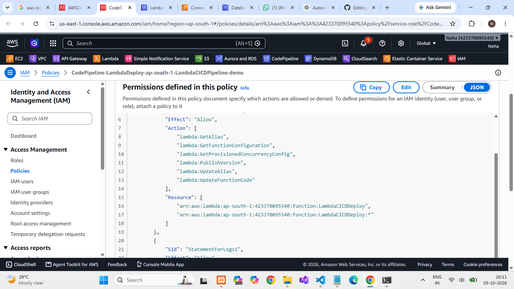

# Automating CI/CD Pipelines Using AWS Lambda

## 1. Project Title and Objective

**Project Title:** Automating CI/CD Pipelines Using AWS Lambda

**Objective:**
This project demonstrates how **AWS Lambda** can automate the deployment step of a CI/CD pipeline. A sample static website is stored in a GitHub repository. When changes are pushed to the `main` branch, **AWS CodePipeline** detects the change and passes the source artifact to a Lambda function. The function extracts the files and deploys them to an **Amazon S3** static website bucket. Execution is monitored with **Amazon CloudWatch**.

The project shows an event-driven, serverless deployment workflow **without using AWS CodeBuild**, since a simple static website does not need a separate build server.

---

## 2. AWS Services Used

| Service | Purpose |
|---|---|
| **GitHub** | Stores the application source code and triggers the pipeline on push |
| **AWS CodePipeline** | Orchestrates the CI/CD workflow (Source stage, then Lambda deployment stage) |
| **AWS Lambda** | Downloads the source artifact, extracts it, uploads the files to S3, and reports the result to CodePipeline |
| **Amazon S3** | Hosts the deployed static website |
| **AWS IAM** | Controls permissions between CodePipeline, Lambda and S3 |
| **Amazon CloudWatch** | Stores Lambda execution logs and metrics for monitoring and troubleshooting |

---

## 3. Architecture / Workflow

### Architecture

```
Developer
    |
    | git push
    v
GitHub Repository
    |
    | Source
    v
AWS CodePipeline
    |
    | Source Artifact
    v
AWS Lambda  ------------> Amazon CloudWatch (Logs)
    |
    | Upload Website Files
    v
Amazon S3 (Static Website Hosting)
    |
    v
Website Users
```

### CI/CD Flow

1. The developer modifies the application and commits the changes.
2. The developer pushes the changes to the GitHub `main` branch.
3. CodePipeline detects the new commit and downloads the source repository.
4. CodePipeline passes the source artifact to the Lambda deployment function.
5. Lambda downloads the ZIP artifact and extracts the application files.
6. Lambda uploads the files to the S3 deployment bucket.
7. Lambda reports success or failure back to CodePipeline.
8. CloudWatch stores the Lambda execution logs.
9. Users can open the updated static website.

### Lambda Deployment Logic

```
Receive CodePipeline Event
          |
          v
Get Source Artifact
          |
          v
Download ZIP Artifact
          |
          v
Extract Files
          |
          v
Upload Files to S3
          |
          v
Deployment Successful?
       /       \
     Yes        No
      |          |
      v          v
CodePipeline   CodePipeline
SUCCESS        FAILURE
```

### Repository Structure

```
CapstoneProject_2_Automating-CI-CD-Pipelines-Using-AWS-Lambda/
│
├── Screenshot/              # Project screenshots
├── lambda-cicd-project/     # Sample website source
├── lambda_function.py       # Lambda deployment function
└── README.md
```

---

## 4. Implementation Steps

1. **Create the source repository** – Push the sample static website (for example `index.html` and `style.css`) to a GitHub repository.
2. **Create the S3 bucket** – Create a bucket and enable **static website hosting**.
3. **Create the Lambda function** – Write `lambda_function.py` to receive the CodePipeline job event, download the source artifact, extract it, upload each file to S3, and call `PutJobSuccessResult` or `PutJobFailureResult`.
4. **Configure the Lambda execution role** – Allow access to S3 and the CodePipeline result APIs.
5. **Create the pipeline in CodePipeline**
   - **Source stage:** GitHub repository, `main` branch.
   - **Deploy stage:** Invoke the Lambda function (no CodeBuild stage).
6. **Grant CodePipeline permission** to invoke the Lambda function.
7. **Push a change to GitHub** and watch the pipeline run automatically.
8. **Verify the deployment** – Check the S3 bucket contents, open the website, and review the CloudWatch logs.

### IAM Permissions

**CodePipeline service role** (invoke the deployment function):

```json
{
  "Effect": "Allow",
  "Action": ["lambda:InvokeFunction"],
  "Resource": "arn:aws:lambda:ap-south-1:ACCOUNT_ID:function:LambdaCICDDeploy"
}
```

**Lambda execution role:**

```
s3:GetObject
s3:PutObject
s3:DeleteObject
s3:ListBucket
codepipeline:PutJobSuccessResult
codepipeline:PutJobFailureResult
```

Restrict these permissions to the specific resources wherever possible (least privilege).

---

## 5. Screenshots

### GitHub Repository


### Pipeline Stages (Source → Deploy)


### Pipeline Execution History


### Lambda IAM Policy


### CodePipeline IAM Policy


### S3 Bucket (Hosted Files)


### Website Before Update


### Website After Update


### CloudWatch Logs Configuration


---

## 6. How to Run or Deploy the Project

### Prerequisites

- An AWS account
- A GitHub account and repository
- Git installed locally
- Region used in this project: `ap-south-1`

### Deploy

1. Clone the repository:
   ```bash
   git clone https://github.com/Farande/CapstoneProject_2_Automating-CI-CD-Pipelines-Using-AWS-Lambda.git
   cd CapstoneProject_2_Automating-CI-CD-Pipelines-Using-AWS-Lambda
   ```
2. Create an S3 bucket and enable static website hosting.
3. Create the Lambda function (for example `LambdaCICDDeploy`), paste in `lambda_function.py`, and attach the execution role described above.
4. Create a CodePipeline with a GitHub **Source** stage and a Lambda **Invoke** stage pointing to the function.
5. Push the initial application:
   ```bash
   git add .
   git commit -m "Initial application"
   git push origin main
   ```
6. Open the S3 website endpoint to see the deployed site.

### Test the Pipeline

**Test 1 – Initial deployment:** Push the application. CodePipeline should start automatically and the files should appear in S3.

**Test 2 – Application update:** Edit `index.html`, for example:

```html
<h1>AWS Lambda CI/CD Pipeline Version 2</h1>
```

Then run:

```bash
git add .
git commit -m "Update website"
git push origin main
```

CodePipeline detects the new commit and deploys the updated files. Compare the *Website Before Update* and *Website After Update* screenshots.

**Test 3 – Failure handling:** Temporarily introduce an invalid configuration or remove a permission. Lambda calls `PutJobFailureResult`, the pipeline stage shows **Failed**, and the error is visible in CloudWatch Logs. Fix the issue and push again to redeploy.

### Monitoring

Open CloudWatch Logs from: **AWS Console → Lambda → LambdaCICDDeploy → Monitor → View CloudWatch Logs**. Useful signals include invocation count, duration, errors and log messages such as *Artifact downloaded*, *Uploaded: index.html* and *Deployment completed*.

---

## 7. Key Learnings

- **Serverless deployment:** Lambda can replace a build server for simple static sites by directly handling the deploy step.
- **CodePipeline and Lambda integration:** A Lambda function in a pipeline must report its result with `PutJobSuccessResult` or `PutJobFailureResult`, otherwise the stage hangs until it times out.
- **IAM roles and least privilege:** CodePipeline needs permission to invoke the function, and Lambda needs separate permissions for S3 and the CodePipeline result APIs.
- **Artifact handling:** Source artifacts arrive as ZIP files in an S3 artifact bucket and must be downloaded and extracted before deployment.
- **Observability:** CloudWatch Logs make it easy to trace each deployment step and diagnose failures.
- **Event-driven automation:** A single `git push` triggers the whole flow from source to a live website with no manual steps.
- **Choosing the right tool:** CodeBuild is unnecessary when there is nothing to compile or test.

---

